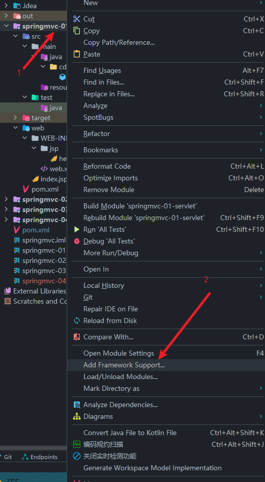
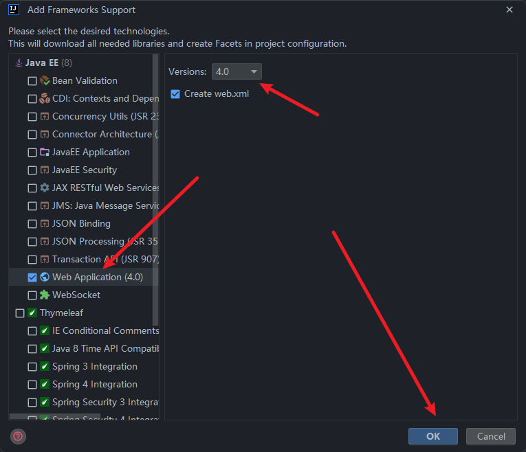
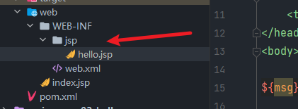
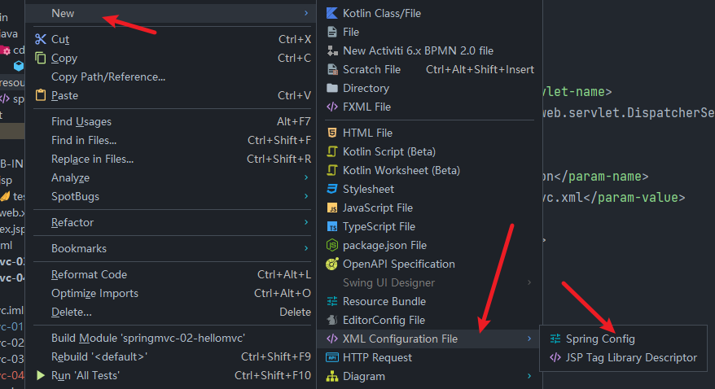
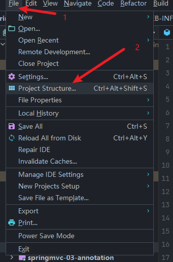
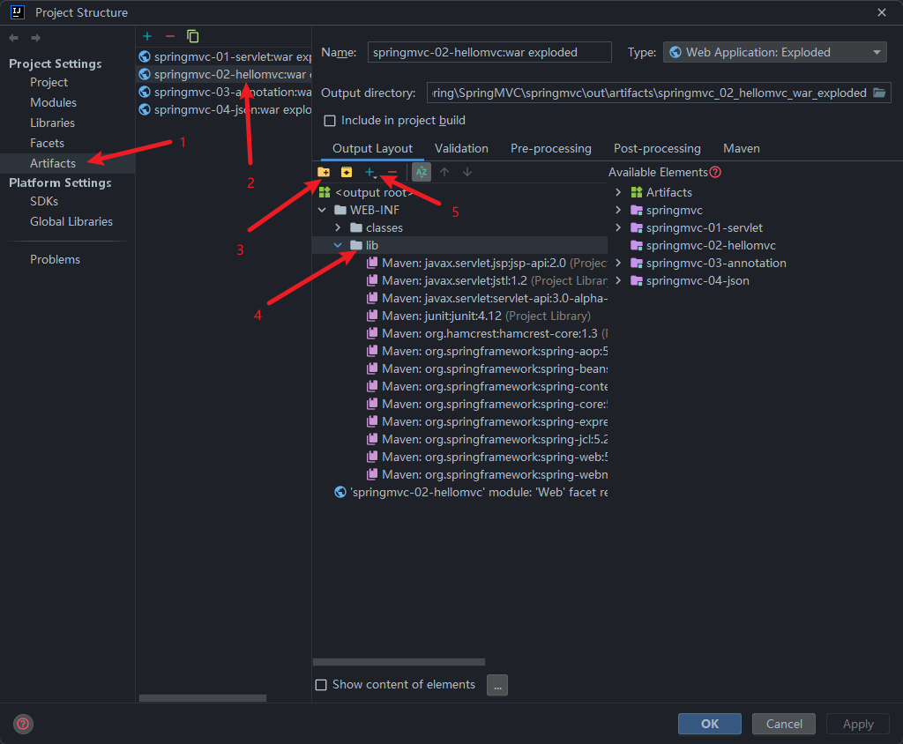

To Learn SpringMVC。

我们新建的项目都应该是**父级项目与子级项目**。

# 回顾Servlet

在进入SpringMVC之前我们先回顾一下Servlet！

我们新建对应的maven项目，在父级目录中导入相应的依赖：

```xml
<dependencies>
    <dependency>
        <groupId>junit</groupId>
        <artifactId>junit</artifactId>
        <version>4.12</version>
        <scope>test</scope>
    </dependency>
    <dependency>
        <groupId>org.springframework</groupId>
        <artifactId>spring-webmvc</artifactId>
        <version>5.2.12.RELEASE</version>
    </dependency>
    <dependency>
        <groupId>javax.servlet</groupId>
        <artifactId>servlet-api</artifactId>
        <version>3.0-alpha-1</version>
    </dependency>
    <dependency>
        <groupId>javax.servlet.jsp</groupId>
        <artifactId>jsp-api</artifactId>
        <version>2.0</version>
    </dependency>
    <dependency>
        <groupId>javax.servlet</groupId>
        <artifactId>jstl</artifactId>
        <version>1.2</version>
    </dependency>
</dependencies>

<!--    解决资源过滤问题-->
<build>
    <resources>
        <resource>
            <directory>src/main/java</directory>
            <includes>
                <include>**/*.properties</include>
                <include>**/*.xml</include>
            </includes>
            <filtering>false</filtering>
        </resource>
        <resource>
            <directory>src/main/resource</directory>
            <includes>
                <include>**/*.properties</include>
                <include>**/*.xml</include>
            </includes>
            <filtering>false</filtering>
        </resource>
    </resources>
</build>
```

然后新建一个**子模块**，也是maven项目！这里值得一提的是我们不用maven自带的 `webapp`框架，因为那个版本太老了！我们用另一种方法去创建！

想下面这样：



然后第二步：



这样子就可以创建最新版的web项目啦！

下面我们编写 `web.xml`配置：

```xml
<?xml version="1.0" encoding="UTF-8"?>
<web-app xmlns="http://xmlns.jcp.org/xml/ns/javaee"
         xmlns:xsi="http://www.w3.org/2001/XMLSchema-instance"
         xsi:schemaLocation="http://xmlns.jcp.org/xml/ns/javaee http://xmlns.jcp.org/xml/ns/javaee/web-app_4_0.xsd"
         version="4.0">

    <servlet>
        <servlet-name>hello</servlet-name>
        <servlet-class>cdu.zch.servlet.HelloServlet</servlet-class>
    </servlet>
    <servlet-mapping>
        <servlet-name>hello</servlet-name>
        <url-pattern>/hello</url-pattern>
    </servlet-mapping>

</web-app>
```

下面我们编写controller去访问：

```java
public class HelloServlet extends HttpServlet {
    @Override
    protected void doGet(HttpServletRequest req, HttpServletResponse resp) throws ServletException, IOException {
        String method = req.getParameter("method");
        if (method.equals("add")) {
            req.getSession().setAttribute("msg", "调用了add方法");
        }
        if (method.equals("delete")) {
            req.getSession().setAttribute("msg", "调用了delete方法");
        }
        req.getRequestDispatcher("WEB-INF/jsp/hello.jsp").forward(req,resp);
    }

    @Override
    protected void doPost(HttpServletRequest req, HttpServletResponse resp) throws ServletException, IOException {
        doGet(req, resp);
    }
}
```

这里要注意，在get方法的最后写上了请求转发，我们必须要加上对应的jsp！



```jsp
<%@ page contentType="text/html;charset=UTF-8" language="java" %>
<html>
<head>
    <title>Hello</title>
</head>
<body>

${msg}

</body>
</html>
```

最后不要忘了配置我们的 `tomcat`！然后启动项目浏览器输入 `localhost:8080/hello?method=add` 或者 `localhost:8080/hello?method=delete`就可以看到相应的效果啦。

# 第一个SpringMVC程序

接下来我们新建一个子模块，操作和上面一样我就不再赘述了。

由于父级项目导入了依赖，我们就不再导入依赖了。

我们只需要五步操作：

1. 编写 `web.xml`文件
2. 创建并编写 `spring-mvc.xml`文件
3. 编写 `Controller`
4. 编写 `jsp`页面
5. 配置tomcat

## 1、编写web.xml

```xml
<?xml version="1.0" encoding="UTF-8"?>
<web-app xmlns="http://xmlns.jcp.org/xml/ns/javaee"
         xmlns:xsi="http://www.w3.org/2001/XMLSchema-instance"
         xsi:schemaLocation="http://xmlns.jcp.org/xml/ns/javaee http://xmlns.jcp.org/xml/ns/javaee/web-app_4_0.xsd"
         version="4.0">

    <!--    配置DispatchServlet-->
    <servlet>
        <servlet-name>DispathchServlet</servlet-name>
        <servlet-class>org.springframework.web.servlet.DispatcherServlet</servlet-class>
        <!--        绑定配置文件-->
        <init-param>
            <param-name>contextConfigLocation</param-name>
            <param-value>classpath:spring-mvc.xml</param-value>
        </init-param>
        <load-on-startup>1</load-on-startup>
    </servlet>
    <!--
    / 和 /* 的区别
    /：只匹配所有的界面，不包括jsp
    /*：包括jsp
    -->
    <servlet-mapping>
        <servlet-name>DispathchServlet</servlet-name>
        <url-pattern>/</url-pattern>
    </servlet-mapping>

</web-app>
```

## 2、创建并编写spring-mvc.xml文件

在 `resource`目录下创建 spring配置文件 `spring-mvc`：



```xml
<?xml version="1.0" encoding="UTF-8"?>
<beans xmlns="http://www.springframework.org/schema/beans"
       xmlns:xsi="http://www.w3.org/2001/XMLSchema-instance"
       xsi:schemaLocation="http://www.springframework.org/schema/beans http://www.springframework.org/schema/beans/spring-beans.xsd">

<!--    处理器映射器-->
    <bean class="org.springframework.web.servlet.handler.BeanNameUrlHandlerMapping"/>
<!--    处理器适配器-->
    <bean class="org.springframework.web.servlet.mvc.SimpleControllerHandlerAdapter"/>
<!--    视图解析器-->
    <bean id="InternalResourceViewResolver" class="org.springframework.web.servlet.view.InternalResourceViewResolver">
        <property name="prefix" value="/WEB-INF/jsp/"/>
        <property name="suffix" value=".jsp"/>
    </bean>

<!--    BeanNameUrlHandlerMapping: bean-->
    <bean id="/hello" class="cdu.zch.controller.HelloController"/>
</beans>
```

## 3、编写controller

新建 `HelloController.java`

```java
public class HelloController implements Controller {
    @Override
    public ModelAndView handleRequest(HttpServletRequest httpServletRequest, HttpServletResponse httpServletResponse) throws Exception {

        ModelAndView mv = new ModelAndView();
        // 业务

        String res = "Hello, SpringMVC";

        mv.addObject("msg", res);

        // 视图跳转
        mv.setViewName("test");
        return mv;
    }
}
```

## 4、编写视图层

```jsp
<%@ page contentType="text/html;charset=UTF-8" language="java" %>
<html>
<head>
    <title>Title</title>
</head>
<body>

${msg}

</body>
</html>
```

## 5、配置tomcat

这里就不赘述了

然后就可以启动项目啦！浏览器输入 `localhost:8080/hello`即可看到效果！

## 可能的错误

有可能会遇到404的经典错误，没关系，这是依赖的问题，我们只需要这样操作：





这里是因为 `lib`目录没有被默认，所以运行的时候依赖没有运行到，所以会出问题，我们只需要加入即可。

# 使用注解开发SpringMVC

我们这里使用注解开发，就不用上面的继承 `Controller`方式，比较繁琐。

我们这里只需要改两个地方：

## 1、修改spring-mvc.xml

```xml
<?xml version="1.0" encoding="UTF-8"?>
<beans xmlns="http://www.springframework.org/schema/beans"
       xmlns:xsi="http://www.w3.org/2001/XMLSchema-instance"
       xmlns:context="http://www.springframework.org/schema/context"
       xmlns:mvc="http://www.springframework.org/schema/mvc"
       xsi:schemaLocation="http://www.springframework.org/schema/beans
       http://www.springframework.org/schema/beans/spring-beans.xsd
       http://www.springframework.org/schema/context
       https://www.springframework.org/schema/context/spring-context.xsd
       http://www.springframework.org/schema/mvc
       https://www.springframework.org/schema/mvc/spring-mvc.xsd">

    <context:component-scan base-package="cdu.zch.controller"/>
    <mvc:default-servlet-handler/>

    <mvc:annotation-driven/>

    <bean id="InternalResourceViewResolver" class="org.springframework.web.servlet.view.InternalResourceViewResolver">
        <property name="prefix" value="/WEB-INF/jsp/"/>
        <property name="suffix" value=".jsp"/>
    </bean>
</beans>
```

## 2、修改Controller

```java
@Controller
public class HelloController {

    @RequestMapping("/hello")
    public String hello(Model model) {
        model.addAttribute("msg", "Hello, Springmvc-Annotation");
        return "hello";
    }

}
```

用注解开发明显比上面简洁多了...

# 兼容RestFul

RestFul是一种开发风格！使我们的url更加简洁并且更安全了！

我们只需要修改一下Controller：

```java
@Controller
public class RestFulController {

    @GetMapping("/h1/{a}/{b}")
    public String test(@PathVariable int a, @PathVariable int b, Model model) {
        int res = a + b;
        model.addAttribute("msg", "结果" + res);
        return "hello";
    }
}
```

这样就是RestFul啦！

# Json格式以及乱码问题！

在现在的前后端分离时代，我们传输数据都是使用`JSON`格式传输的。但是有问题就是可能会出现乱码！乱码是做Web开发逃不掉的！所以我们通过配置过滤一下乱码。

## 过滤乱码

我们这里配置乱码有两种解决方式：

1. 使用springmvc默认的乱码解决方式
2. 使用自定义过滤器

首先配置 `web.xml`

```xml
<!--    配置乱码解决 使用SpringMVC默认的乱码解决方式-->
<filter>
    <filter-name>encoding</filter-name>
    <filter-class>org.springframework.web.filter.CharacterEncodingFilter</filter-class>
    <init-param>
        <param-name>encoding</param-name>
        <param-value>utf-8</param-value>
    </init-param>
</filter>
<filter-mapping>
    <filter-name>encoding</filter-name>
    <url-pattern>/*</url-pattern>
</filter-mapping>
<!--    配置乱码解决2，使用通用过滤器-->
<!--    <filter>-->
<!--        <filter-name>encoding</filter-name>-->
<!--        <filter-class>cdu.zch.filter.GenericEncodingFilter</filter-class>-->
<!--        <init-param>-->
<!--            <param-name>encoding</param-name>-->
<!--            <param-value>utf-8</param-value>-->
<!--        </init-param>-->
<!--    </filter>-->
<!--    <filter-mapping>-->
<!--        <filter-name>encoding</filter-name>-->
<!--        <url-pattern>/*</url-pattern>-->
<!--    </filter-mapping>-->
```

如果是自定过滤器，则还需要创建一个自定义的过滤器类：

```java
package cdu.zch.filter;

import javax.servlet.*;
import javax.servlet.http.HttpServletRequest;
import javax.servlet.http.HttpServletRequestWrapper;
import javax.servlet.http.HttpServletResponse;
import java.io.IOException;
import java.io.UnsupportedEncodingException;
import java.util.Map;

/**
 * 解决get和post请求 全部乱码的过滤器
 * @author Zch
 * 这是在网上找的通过过滤编码器，用于在极端情况下处理字符乱码问题
 */
public class GenericEncodingFilter implements Filter {

    @Override
    public void destroy() {
    }

    @Override
    public void doFilter(ServletRequest request, ServletResponse response, FilterChain chain) throws IOException, ServletException {
        //处理response的字符编码
        HttpServletResponse myResponse = (HttpServletResponse) response;
        myResponse.setContentType("text/html;charset=UTF-8");

        // 转型为与协议相关对象
        HttpServletRequest httpServletRequest = (HttpServletRequest) request;
        // 对request包装增强
        HttpServletRequest myrequest = new MyRequest(httpServletRequest);
        chain.doFilter(myrequest, response);
    }

    @Override
    public void init(FilterConfig filterConfig) throws ServletException {
    }

}

//自定义request对象，HttpServletRequest的包装类
class MyRequest extends HttpServletRequestWrapper {

    private HttpServletRequest request;
    //是否编码的标记
    private boolean hasEncode;

    //定义一个可以传入HttpServletRequest对象的构造函数，以便对其进行装饰
    public MyRequest(HttpServletRequest request) {
        super(request);// super必须写
        this.request = request;
    }

    // 对需要增强方法 进行覆盖
    @Override
    public Map getParameterMap() {
        // 先获得请求方式
        String method = request.getMethod();
        if (method.equalsIgnoreCase("post")) {
            // post请求
            try {
                // 处理post乱码
                request.setCharacterEncoding("utf-8");
                return request.getParameterMap();
            } catch (UnsupportedEncodingException e) {
                e.printStackTrace();
            }
        } else if (method.equalsIgnoreCase("get")) {
            // get请求
            Map<String, String[]> parameterMap = request.getParameterMap();
            if (!hasEncode) { // 确保get手动编码逻辑只运行一次
                for (String parameterName : parameterMap.keySet()) {
                    String[] values = parameterMap.get(parameterName);
                    if (values != null) {
                        for (int i = 0; i < values.length; i++) {
                            try {
                                // 处理get乱码
                                values[i] = new String(values[i]
                                        .getBytes("ISO-8859-1"), "utf-8");
                            } catch (UnsupportedEncodingException e) {
                                e.printStackTrace();
                            }
                        }
                    }
                }
                hasEncode = true;
            }
            return parameterMap;
        }
        return super.getParameterMap();
    }

    //取一个值
    @Override
    public String getParameter(String name) {
        Map<String, String[]> parameterMap = getParameterMap();
        String[] values = parameterMap.get(name);
        if (values == null) {
            return null;
        }
        return values[0]; // 取回参数的第一个值
    }

    //取所有值
    @Override
    public String[] getParameterValues(String name) {
        Map<String, String[]> parameterMap = getParameterMap();
        String[] values = parameterMap.get(name);
        return values;
    }
}

```

## JSON乱码

在使用JSON的时候我们可以用很多第三方工具类，比如Jackson、fastjson、fastjson2等等...

但是也可能会遇到乱码问题，我们需要在 `spring-mvc.xml`中增加如下配置：

```xml
<!--    Json乱码配置-->
<mvc:annotation-driven>
    <mvc:message-converters register-defaults="true">
        <bean class="org.springframework.http.converter.StringHttpMessageConverter">
            <property name="supportedMediaTypes">
                <list>
                    <value>text/html;charset=UTF-8</value>
                    <value>application/json;charset=UTF-8</value>
                </list>
            </property>
        </bean>
    </mvc:message-converters>
</mvc:annotation-driven>
```

使用第三方工具类操作json数据我就不多赘述了，在代码里面都有的。